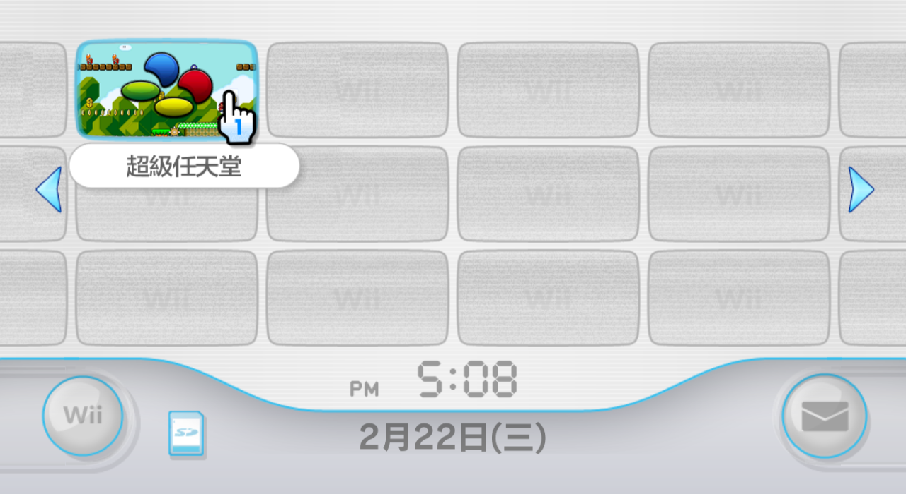
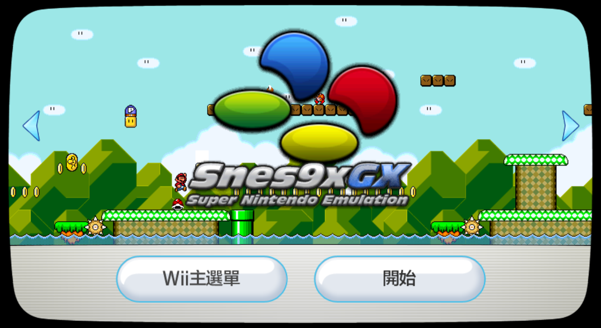

# Snes9x GX 自制频道一览

## 一、Snes9xGX-Forwarder1-SNES.wad

| Icon | Banner |
| :---: | :---: |
|  |  |

## 二、Snes9xGX-Forwarder2-SNES.wad

| Icon | Banner |
| :---: | :---: |
|  |  |

## 三、Snes9xGX-Forwarder-SDXD.wad

| Icon | Banner |
| :---: | :---: |
|  |  |

## 四、Snes9xGX-Forwarder-SDXD-TWN4.3.wad

TWN4.3 系统专用，基于 Snes9xGX-Forwarder-SDXD.wad 制作：

| Icon | Banner |
| :---: | :---: |
|  |  |
| 提示文字修改为繁体中文 | 中央展示模拟器的英文名 |
