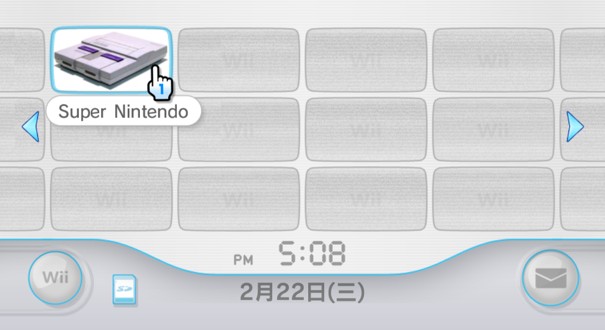

# Snes9x GX 自制频道一览

## Snes9xGX-Forwarder-SDXD.wad

## Snes9xGX-Forwarder-SDXD-TWN4.3.wad

TWN4.3 系统专用，基于 FCEUltraGX-Forwarder1-FCEU.wad 制作，提示文字修改为繁体中文：

预览画面的中央展示模拟器的英文名：

## Snes9xGX-Forwarder-SNES.wad

