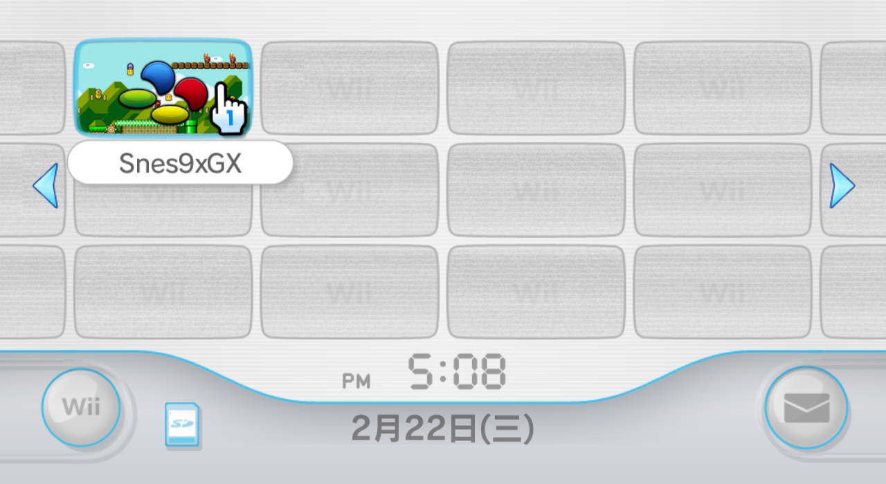
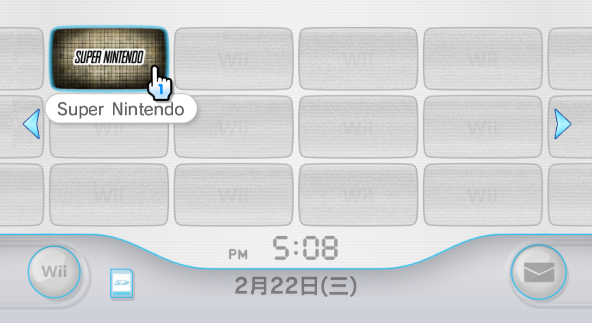

# Snes9x GX 频道一览

## 一、Snes9xGX-Channel-Installer.zip

官方提供的频道安装器：

安装后的界面效果如下：

| Icon | Banner |
| :---: | :---: |
|  |  |

## 二、Snes9xGX-Forwarder1-SNES.wad

| Icon | Banner |
| :---: | :---: |
|  |  |

## 三、Snes9xGX-Forwarder2-SNES.wad

| Icon | Banner |
| :---: | :---: |
|  |  |

## 四、Snes9xGX-Forwarder-SDXD.wad

| Icon | Banner |
| :---: | :---: |
|  |  |

## 五、Snes9xGX-Forwarder-SDXD-ZHTW.wad

繁体中文系统专用，基于 Snes9xGX-Forwarder-SDXD.wad 制作：

| Icon | Banner |
| :---: | :---: |
|  |  |
| 提示文字修改为繁体中文 | 中央展示模拟器的英文名 |

## 六、Snes9xGX-RunningSnakes-DSNB.wad

| Icon | Banner |
| :---: | :---: |
|  |  |
